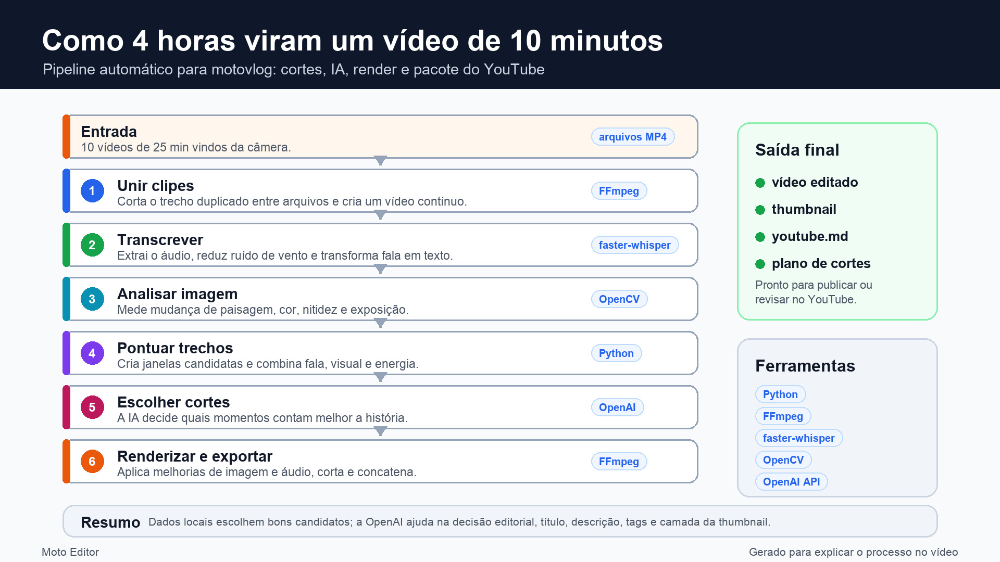

# Bike Editor

Bike Editor é uma ferramenta em Python para transformar longas gravações de câmera de moto em um motovlog mais curto, pronto para o YouTube.

Ela foi criada para o fluxo comum de câmeras de ação: um passeio vira vários arquivos de vídeo, e cada arquivo pode repetir alguns segundos do anterior. O script junta os clipes, remove o trecho duplicado, analisa o passeio, escolhe os melhores momentos, renderiza o vídeo final e prepara os metadados do YouTube.



## O Que Ele Faz

- Encontra todos os vídeos em uma pasta de entrada.
- Junta os clipes em uma fonte contínua, removendo o overlap fixo da câmera.
- Melhora imagem e áudio com filtros do FFmpeg.
- Transcreve a narração localmente com `faster-whisper`.
- Pontua trechos candidatos usando densidade de fala e mudanças visuais.
- Usa a OpenAI API, quando configurada, para escolher o plano final de edição.
- Renderiza um MP4 final com os segmentos selecionados.
- Gera uma thumbnail usando um frame real do vídeo com uma camada criada por IA.
- Escreve `youtube.md` com título, descrição, tags e texto de thumbnail.

## Requisitos

- Python 3.10+
- FFmpeg e FFprobe disponíveis no terminal
- Uma chave da OpenAI API se você quiser decisões de edição e thumbnails assistidas por IA

Instale as dependências Python:

```bash
python3 -m venv .venv
source .venv/bin/activate
pip install -r requirements.txt
```

No macOS, o FFmpeg pode ser instalado com:

```bash
brew install ffmpeg
```

## Configuração

Copie o arquivo de exemplo:

```bash
cp .env.example .env
```

Depois edite o `.env` com seus próprios valores.

Configurações importantes:

- `OPENAI_API_KEY`: sua chave da OpenAI API.
- `CAMERA_OVERLAP_SECONDS`: quantos segundos duplicados existem no começo de cada clipe depois do primeiro.
- `AI_MODEL`: modelo usado para decisões de edição e metadados do YouTube.
- `IMAGE_MODEL`: modelo usado para gerar a camada da thumbnail.
- `CREATOR_*`, `PREVIOUS_MOTORCYCLE_*`, `CURRENT_MOTORCYCLE_*`: contexto opcional do canal para ajudar a IA a evitar erros factuais.
- `VIDEO_ENHANCE_FILTER` e `AUDIO_ENHANCE_FILTER`: filtros do FFmpeg para limpar imagem e áudio.

O `.env` é ignorado pelo Git, então sua chave de API e contexto pessoal não devem ser commitados.

## Uso

Execução básica:

```bash
python moto_editor.py \
  --input "/caminho/para/videos" \
  --target-minutes 10 \
  --output-dir "./outputs/meu-role"
```

Com título e descrição opcionais:

```bash
python moto_editor.py \
  --input "/caminho/para/videos" \
  --target-minutes 10 \
  --title "Primeiro passeio com a moto nova" \
  --description "Um rolê curto para sentir a moto na cidade." \
  --output-dir "./outputs/meu-role"
```

Se título ou descrição forem informados, a IA revisa e melhora mantendo a intenção. Se forem omitidos, a IA gera esses textos a partir do contexto do vídeo.

## Outputs

Para um alvo de 10 minutos, a pasta de saída terá arquivos como:

- `moto_editado_10min.mp4`: vídeo final editado.
- `thumbnail_openai_10min.png`: thumbnail gerada, quando a geração de imagem da OpenAI estiver ativa.
- `youtube.md`: título, descrição, tags e texto de thumbnail.
- `edit_plan_10min.json`: plano de edição estruturado.
- `edit_plan_10min.csv`: cortes selecionados em formato amigável para planilhas.
- `transcript.json`: transcrição local.
- `candidates.json`: trechos candidatos pontuados.

A pasta `outputs/` é ignorada pelo Git porque vídeos renderizados e arquivos de trabalho podem ficar muito grandes.

## Cache

O script reaproveita trabalho já existente na pasta de saída:

- Transcrição existente é reutilizada.
- Análise visual existente é reutilizada.
- Pontuação de candidatos existente é reutilizada.
- Um plano compatível é reutilizado para o mesmo tempo alvo.
- Vídeos e thumbnails já renderizados são reutilizados, a menos que você force a recriação.

Flags úteis:

```bash
--force-analysis    # refaz transcrição, amostras visuais e candidatos
--force-ai          # pede um novo plano para a OpenAI
--force-render      # renderiza segmentos e vídeo final novamente
--force-thumbnail   # gera uma nova thumbnail
--no-openai         # roda sem OpenAI
--local-thumbnail   # pula thumbnail via OpenAI e usa texto local
```

## Observações

ChatGPT Plus e cobrança/créditos da OpenAI API são produtos separados. Este projeto usa a OpenAI API, então você precisa de uma chave de API com billing ou créditos disponíveis.
